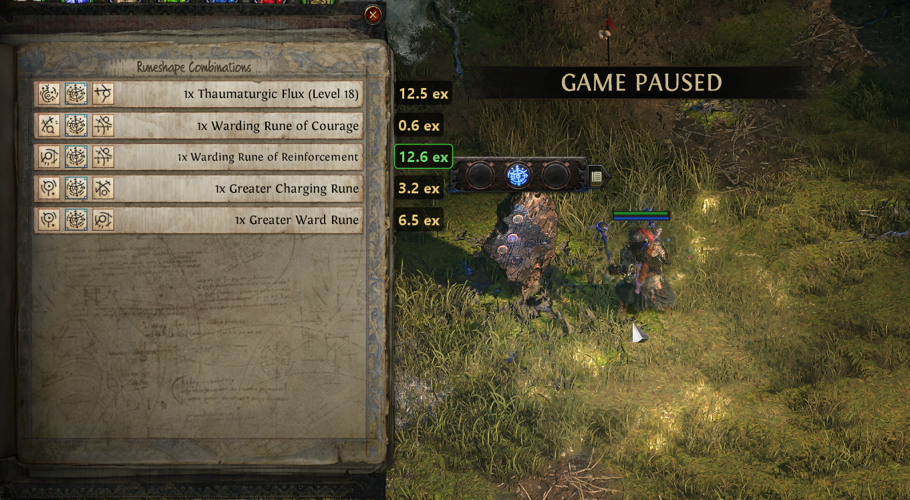

# PoE2 Rune Checker

Price overlay for the **Runeshape Combinations** window in Path of Exile 2.
It reads each recipe row via OCR, fetches live prices from
[poe.ninja](https://poe.ninja/poe2) and shows the value of every reward right
over the game — so you instantly see which rune is worth crafting.

**[English](#english) · [Русский](#русский)**

> ⚠️ **Works with the English game client only (for now).**
> Работает только с **английским клиентом** игры (пока что).



---

## English

### ⬇️ Download (prebuilt)

Grab the RAR from the [**Releases**](https://github.com/or1k/Poe2_rune_checker/releases/latest)
page ([direct link](https://github.com/or1k/Poe2_rune_checker/releases/download/v0.1.0/PoE2RuneChecker-v0.1.0-win64.rar)) —
extract and run `PoE2RuneChecker.exe`. **No Java needed**, everything is bundled.

### 🎮 How to use

1. Run `PoE2RuneChecker.exe` — a small control window opens (league selector).
2. In game, open the **Runeshape Combinations** window — the game pauses.
3. Prices in exalted appear next to each row; the most valuable one is highlighted green.
4. Close the rune window → prices disappear. The window's ✕ minimizes it to tray.

> Works in **Windowed Fullscreen / Borderless** (and usually in plain Fullscreen on
> Win10/11 thanks to Fullscreen Optimizations). **English game client only (for now).**

### ✨ Features

- 💰 Live poe.ninja PoE2 prices — **all 13 categories** (currency, fragments, runes,
  soul cores, essences, idols, lineage gems, verisium, abyss, breach, expedition,
  liquid emotions, omens) — ~595 items.
- 🔍 OCR with fuzzy name matching (tolerates recognition errors).
- 🏆 Highlights the most valuable row, shows "total (each)".
- ⏸️ Hides prices via the "GAME PAUSED" banner when the window closes.
- 💾 Disk price cache, refreshed at most once every 15 minutes.
- 🔁 League switching (Runes of Aldur / HC / Standard) in the window or tray.
- 🖱️ Transparent click-through overlay (clicks pass through to the game).
- 📦 Self-contained `.exe` (bundled JRE + JavaFX + Tesseract + tessdata).

### 🛠️ Stack

Java 23 · JavaFX (UI) · Swing/AWT (transparent overlay) · Tesseract OCR (tess4j) ·
Jackson (JSON) · JNA (click-through) · jpackage (.exe).

### 🔨 Build from source

Requires JDK 23 and Maven.

**Dev run:**
```
run.bat            # or: mvn javafx:run
```

**Build the .exe:** download JavaFX 23.0.1 jmods (Windows x64) from
[gluonhq](https://gluonhq.com/products/javafx/), extract into
`tools/javafx-jmods-23.0.1/`, then:
```
build-exe.bat
```
Output — `dist/PoE2RuneChecker/PoE2RuneChecker.exe`.

### ☕ Support

If the tool helped — [donatello.to/Or1on4ik](https://donatello.to/Or1on4ik). Totally optional.

### ⚠️ Disclaimer

Uses only public poe.ninja data and screen recognition — it **does not read game
memory or automate actions**, in line with GGG's policy on overlays (like Awakened
PoE Trade). Use at your own risk.

---

## Русский

### ⬇️ Скачать (готовая сборка)

Качай RAR со страницы [**Releases**](https://github.com/or1k/Poe2_rune_checker/releases/latest)
([прямая ссылка](https://github.com/or1k/Poe2_rune_checker/releases/download/v0.1.0/PoE2RuneChecker-v0.1.0-win64.rar)) —
распакуй и запусти `PoE2RuneChecker.exe`. **Java ставить не нужно**, всё вшито.

### 🎮 Как пользоваться

1. Запусти `PoE2RuneChecker.exe` — откроется небольшое окно управления (выбор лиги).
2. Зайди в игру, открой окно **«Runeshape Combinations»** — игра встаёт на паузу.
3. Поверх строк появятся цены в exalted; самая выгодная подсвечивается зелёным.
4. Закрыл окно рун — цены пропадают. Крестик окна сворачивает его в трей.

> Работает в режиме **Windowed Fullscreen / Borderless** (а на Win10/11 обычно и в
> «полноэкранном» благодаря Fullscreen Optimizations). **Только английский клиент игры (пока что).**

### ✨ Возможности

- 💰 Реальные цены с poe.ninja PoE2 — **все 13 категорий** (валюта, фрагменты, руны,
  soul cores, эссенции, идолы, lineage gems, verisium, abyss, breach, expedition,
  liquid emotions, omens) — ~595 предметов.
- 🔍 OCR с fuzzy-сопоставлением названий (терпит ошибки распознавания).
- 🏆 Подсветка самой выгодной строки, формат «итог (за штуку)».
- ⏸️ Прячет цены по баннеру «GAME PAUSED» при закрытии окна.
- 💾 Кэш цен на диск, обновление не чаще раза в 15 минут.
- 🔁 Переключение лиг (Runes of Aldur / HC / Standard) в окне или трее.
- 🖱️ Прозрачный click-through оверлей (клики проходят в игру).
- 📦 Самодостаточный `.exe` (вшитая JRE + JavaFX + Tesseract + tessdata).

### 🛠️ Стек

Java 23 · JavaFX (UI) · Swing/AWT (прозрачный оверлей) · Tesseract OCR (tess4j) ·
Jackson (JSON) · JNA (click-through) · jpackage (.exe).

### 🔨 Сборка из исходников

Нужны JDK 23 и Maven.

**Dev-запуск:**
```
run.bat            # или: mvn javafx:run
```

**Сборка .exe:** скачай JavaFX 23.0.1 jmods (Windows x64) с
[gluonhq](https://gluonhq.com/products/javafx/) и распакуй в
`tools/javafx-jmods-23.0.1/`, затем:
```
build-exe.bat
```
Результат — `dist/PoE2RuneChecker/PoE2RuneChecker.exe`.

### ☕ Поддержать

Если тулза пригодилась — [donatello.to/Or1on4ik](https://donatello.to/Or1on4ik). Совершенно по желанию.

### ⚠️ Дисклеймер

Использует только публичные данные poe.ninja и распознавание экрана — **не читает
память игры и не автоматизирует действия**, что соответствует политике GGG в отношении
оверлеев (как Awakened PoE Trade). Используешь на свой риск.
